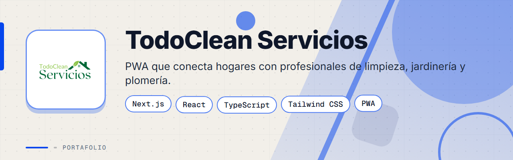
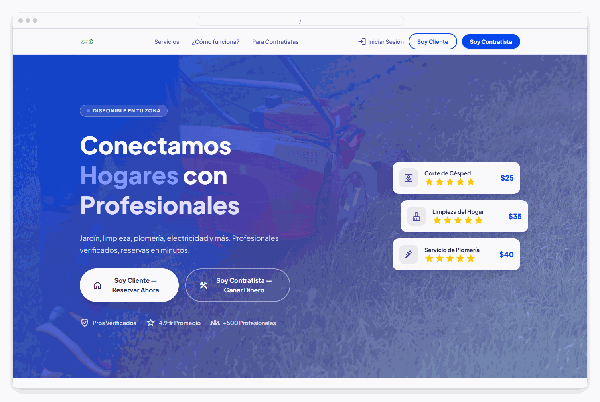
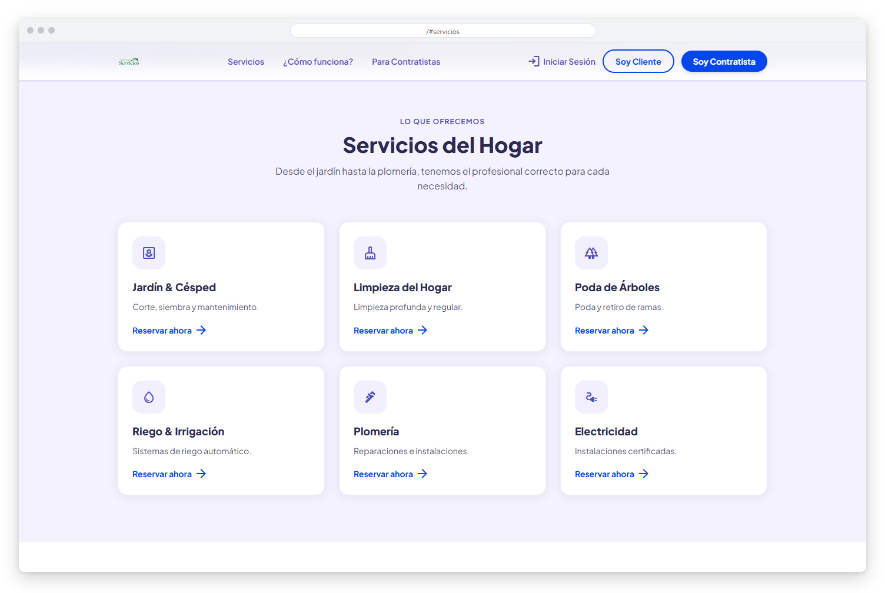
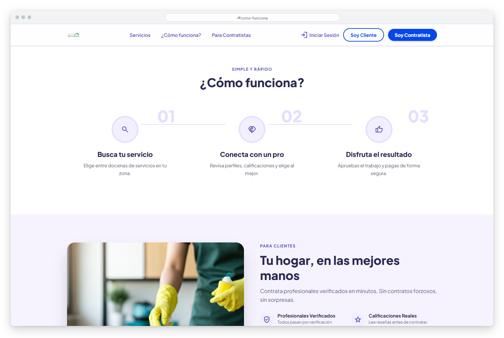
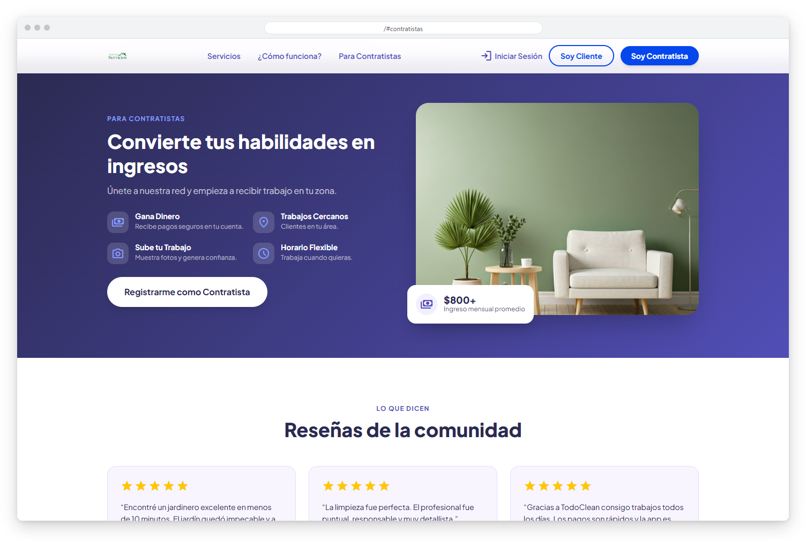
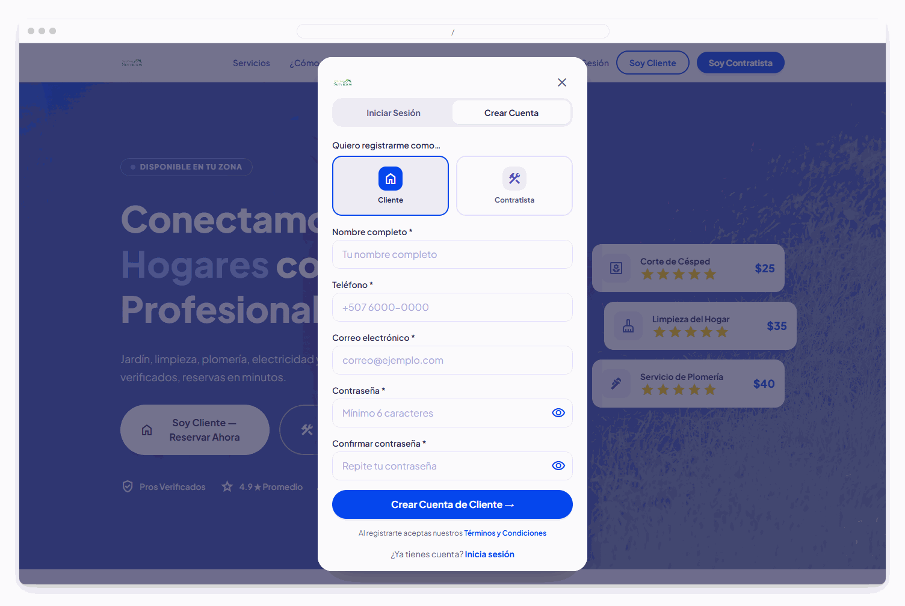
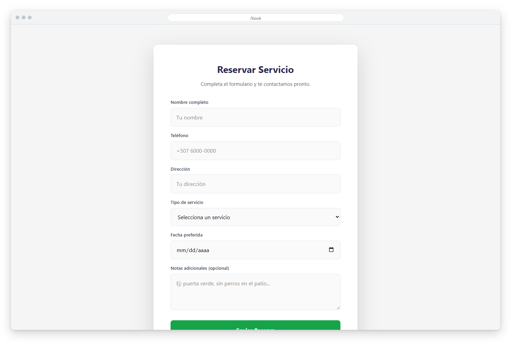
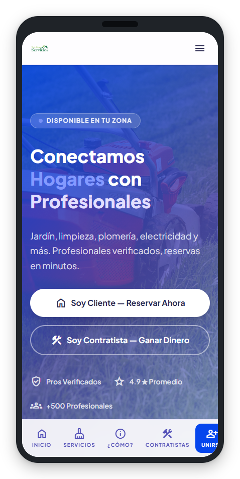
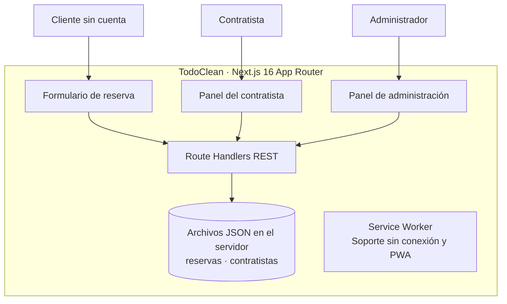

<div align="center">



# TodoClean Servicios


**Plataforma PWA que conecta dueños de hogares con profesionales de limpieza, jardinería, plomería y más, con reservas en minutos y sin necesidad de crear una cuenta.**

**[Ver el sitio en producción](https://todocleanservicios.sytes.net/)**

</div>

> Este es un **portafolio showcase**: el código fuente es propietario y no está incluido.

---

## Contenido

- [El Problema](#el-problema)
- [La Solución](#la-solución)
- [Funcionalidades](#funcionalidades)
- [Vista Previa](#vista-previa)
- [Arquitectura](#arquitectura)
- [Stack Tecnológico](#stack-tecnológico)
- [Instalación local](#instalación-local)
- [Roadmap](#roadmap)
- [Contacto](#contacto)

---

## El Problema

Contratar servicios del hogar es un proceso fragmentado: búsquedas en redes sociales, llamadas sin respuesta y proveedores sin verificación ni historial visible. Los clientes no saben con quién contratan, y los contratistas independientes no tienen un canal para conseguir clientes de forma constante.

---

## La Solución

TodoClean es un marketplace bidireccional: los clientes reservan en minutos (sin crear cuenta), los contratistas reciben asignaciones directas y el administrador gestiona toda la operación desde un panel centralizado, todo dentro de una PWA instalable en el celular.

---

## Funcionalidades

| Funcionalidad | Descripción |
|---------------|-------------|
| Reserva sin cuenta | Los clientes envían solicitudes con nombre, teléfono, dirección, servicio, fecha y notas |
| Panel de administración | Vista de todas las reservas y seguimiento de su estado (pendiente, asignada, completada) |
| Asignación de trabajos | El administrador asigna contratistas registrados a cada reserva |
| Panel del contratista | Los profesionales inician sesión y ven los trabajos que se les asignaron |
| Panel del cliente | Los clientes registrados consultan su historial de reservas |
| Roles diferenciados | Flujos de cliente, contratista y administrador desde una sola capa de autenticación |
| PWA instalable | Se instala en móvil y escritorio, con página sin conexión personalizada mediante Service Worker |

---

## Vista Previa



<table>
  <tr>
    <td width="50%">
      
      <br><b>Servicios</b>: catálogo de jardín, limpieza, poda, riego, plomería y electricidad.
    </td>
    <td width="50%">
      
      <br><b>¿Cómo funciona?</b>: tres pasos para buscar, conectar y recibir el servicio.
    </td>
  </tr>
  <tr>
    <td width="50%">
      
      <br><b>Para contratistas</b>: captación de profesionales con beneficios y reseñas.
    </td>
    <td width="50%">
      
      <br><b>Registro</b>: crear cuenta como cliente o contratista.
    </td>
  </tr>
  <tr>
    <td width="50%">
      
      <br><b>Reservar</b>: formulario para solicitar un servicio con fecha y notas.
    </td>
    <td width="50%" align="center">
      
      <br><b>Versión móvil</b>: la página de inicio adaptada a pantallas pequeñas, con navegación inferior.
    </td>
  </tr>
</table>

---

## Arquitectura



**API REST:** `GET` y `POST /api/bookings`, `PATCH /api/bookings/[id]` (asignar contratista), `GET` y `POST /api/workers`.

---

## Stack Tecnológico

| Capa | Tecnología |
|------|-----------|
| Framework | Next.js 16 (App Router, Turbopack) |
| UI | React 19 · Tailwind CSS 4 |
| Lenguaje | TypeScript 5 |
| API | Next.js Route Handlers (REST) |
| Persistencia | Archivos JSON en el servidor, vía Node.js `fs` |
| PWA | Web App Manifest + Service Worker personalizado |
| Despliegue | Linux VPS · PM2 · Bluehost |

---

## Instalación local

> **Aviso:** el código es privado y propietario. Estos pasos son solo para colaboradores autorizados con acceso al repositorio.

1. Instala Node.js (versión compatible con Next.js 16).
2. Instala las dependencias:
   ```bash
   npm install
   ```
3. Inicia el entorno de desarrollo y abre `http://localhost:3000`:
   ```bash
   npm run dev
   ```
4. Para producción, compila y arranca el servidor:
   ```bash
   npm run build
   npm start
   ```

---

## Roadmap

- [ ] Migrar la persistencia de archivos JSON a una base de datos.
- [ ] Verificación de identidad y reseñas reales de contratistas.
- [ ] Notificaciones al cliente y al contratista cuando cambie el estado de una reserva.

---

## Contacto

El código fuente es propietario. Para consultas o propuestas, escríbeme:

[](mailto:pablozam1931@gmail.com)
[%206517--1870-25D366?style=for-the-badge&logo=whatsapp&logoColor=white)](https://wa.me/50765171870)
[](https://github.com/deadlyrat)

- Correo: [pablozam1931@gmail.com](mailto:pablozam1931@gmail.com)
- WhatsApp: [(507) 6517-1870](https://wa.me/50765171870)
- GitHub: [github.com/deadlyrat](https://github.com/deadlyrat)

---

*Parte del portafolio de [deadlyrat](https://github.com/deadlyrat)*
