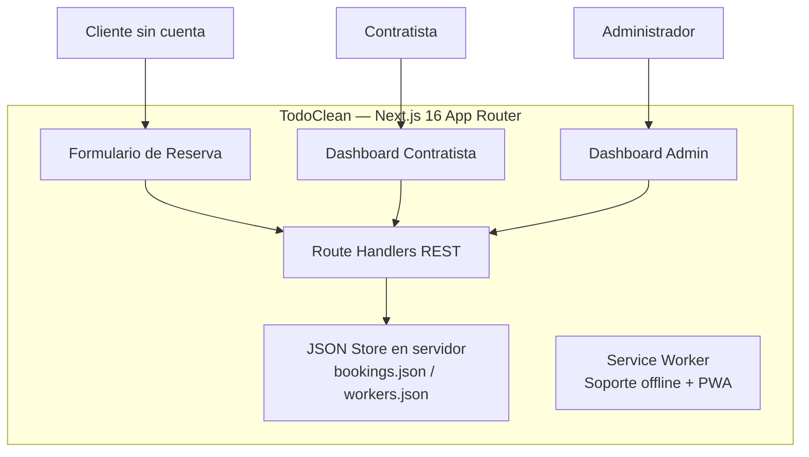
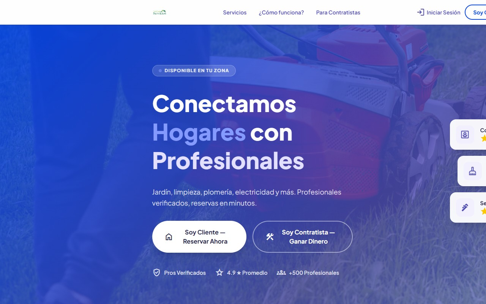

# TodoClean — Servicios del Hogar

 
 
 

> **Plataforma PWA que conecta duenos de hogares con profesionales verificados — reservas de limpieza, jardineria, plomeria y mas en minutos, sin necesidad de cuenta.**

> Este es un **portfolio showcase** — el codigo fuente es propietario y no esta incluido.

---

## El Sitio

**[todocleanservicios.sytes.net](https://todocleanservicios.sytes.net/)** — sitio en produccion.

---

## El Problema

Contratar servicios del hogar es un proceso fragmentado: busquedas en redes sociales, llamadas sin respuesta, proveedores sin verificacion y sin historial visible. Los clientes no saben con quien contratan, y los contratistas independientes no tienen canal para conseguir clientes de forma constante.

---

## La Solucion

TodoClean es un marketplace bidireccional donde los clientes reservan en minutos (sin crear cuenta), los contratistas reciben asignaciones directas, y el admin gestiona toda la operacion desde un dashboard centralizado.

---

## Funcionalidades

| Funcionalidad | Descripcion |
|--------------|-------------|
| Reserva sin cuenta | Los clientes envian solicitudes con nombre, telefono, direccion, servicio y fecha |
| Dashboard admin | Vista de todas las reservas — pendientes, asignadas y completadas |
| Asignacion de trabajos | El admin asigna contratistas disponibles a cada reserva |
| Panel del contratista | Los profesionales ven sus trabajos asignados al iniciar sesion |
| PWA instalable | Funciona como app nativa en Android e iOS — con pagina offline personalizada |
| Roles diferenciados | Flujos separados para cliente / contratista / admin desde una sola aplicacion |

---

## Arquitectura

---

## Stack Tecnologico

| Capa | Tecnologia |
|------|-----------|
| Framework | Next.js 16 (App Router, Turbopack) |
| UI | React 19 · Tailwind CSS 4 |
| Lenguaje | TypeScript 5 |
| API | Next.js Route Handlers (REST) |
| Persistencia | JSON file store via Node.js `fs` |
| PWA | Web App Manifest + Service Worker personalizado |
| Despliegue | Linux VPS · PM2 · Bluehost |

---

## Vista Previa

---

## Contacto

El codigo fuente es propietario. Para consultas: [pablozam1931@gmail.com](mailto:pablozam1931@gmail.com)

---

*Parte del portfolio [deadlyrat](https://github.com/deadlyrat).*
